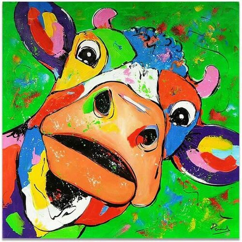

# Clustering de couleurs

## Objectif
Ce projet à été réalisé dans le cadre du cours de forage de données de l'UQAC à l'automne 2021. Il vise à approfondir les connaissances en clusturing de données, notamment les algorithmes KMeans et DBScan.

## Technologie
Cette application est développée en python (3.7.8). Le point d'entrée du programme se trouve dans le fichier [main.py](https://github.com/LepoittevinTitouan/ColorClustering/blob/master/main.py).

L'interface à été réalisée avec *tkinter*, tandis que les algorithmes de clustering sont implémentés par mes soins. Les dépendances ne faisant pas partie des librairies standard de python sont *numpy*, *matplotlib* et *Pillow*.

## Utilisation
Dans la fenêtre de l'application, un bouton permet d'ouvrir l'explorateur de fichier pour sélectionner une image d'entrée. 

Un autre bouton, placé en haut de la fenetre, permet d'alterner entre deux calculs de la distance. Les deux algorithmes étudiés utilisent cette distance, on peut choisir entre la distance Euclidienne : $$d = \sqrt{(R_a-R_b)^2+(G_a - G_b)^2+(B_a - B_b)}$$ et la distance de Manhattan : $$d = |R_a - R_b|+|G_a - G_b|+|B_a - B_b|$$ pour des pixels de la forme : $$A=(R_a,G_a,B_a)$$

Deux boutons, placés à droite de l'image, permettent de sélectionner l'algorithme avec lequel sera traité l'image. Lors de la sélection de KMeans, une fenêtre va proposer d'entrer un nombre entier de clusters k. Tandis qu'un clic sur le bouton DBScan lancera instantanément l'algorithme avec les paramètres indiqué dans le code.

Pour changer les paramètres epsilon et minPts de l'algorihme DBScan, il faut se rendre dans le fichier [main.py](https://github.com/LepoittevinTitouan/ColorClustering/blob/master/main.py), dans la fonction `startDBscan(filename)` aux lignes 39 & 40 et modifier le paramètre souhaité avant d'enregistrer et d'exécuter le code à nouveau. 

**Attention** : A la fin de l'exécution de l'algorithme, l'image affichée dans l'application sera modifiée : chaque pixel prend la couleur du cluster auquel il est associé, pour KMeans avec k = 16, il n'y aura donc plus que 16 couleurs. En lancant un nouvel algorithme, l'image traitée ne sera alors pas l'image affichée, mais celle sélectionnée précédemment avec l'explorateur de fichier, et ce, jusqu'à ce qu'une autre image sois sélectionnée par ce moyen.

## Performances
Malgré l'utilisation de multiprocessing lorsque possible, l'exécution des algorithme de clustering étudiés dans ce projet reste relativement lente.

Afin de donner un ordre d'idée, avec cette image (500x500) : 

Le traitement de KMeans avec 16 clusters prend environ 1 minute 20, et jusqu'à 7 ou 8 minutes avec 64 clusters.

De la même façon, une tolérance à été donnée pour que le temps de calcul sois réduit. On peut ci-dessous comparer le nombre d'itération et l'évolution des centroïdes avec et sans la tolérance :

